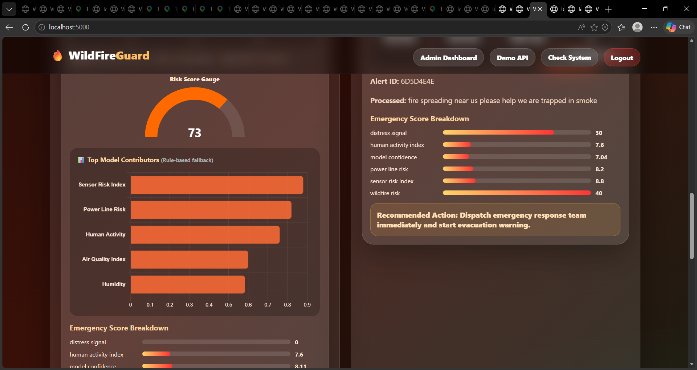
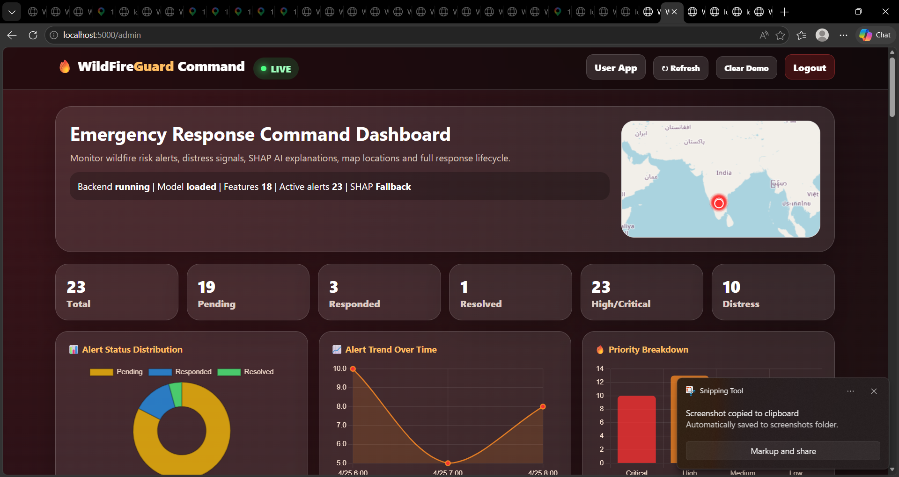
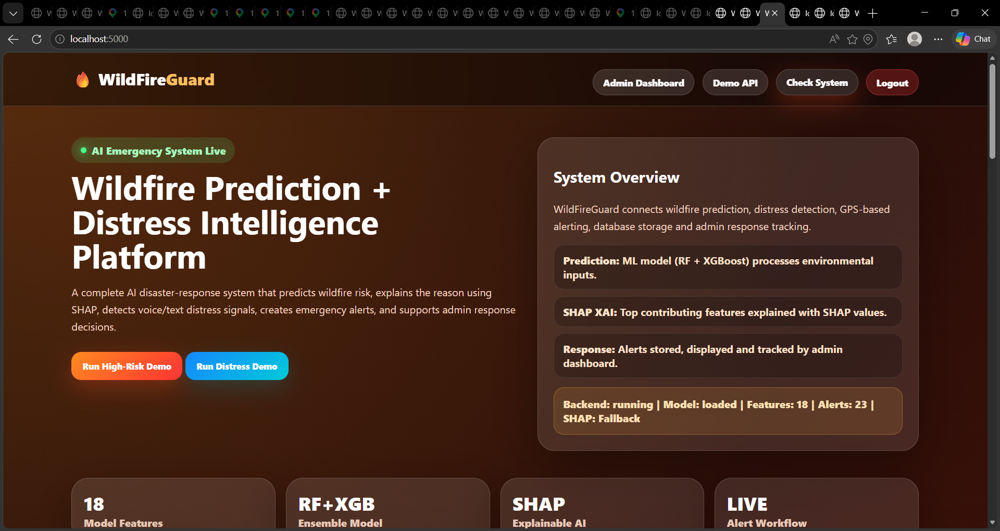
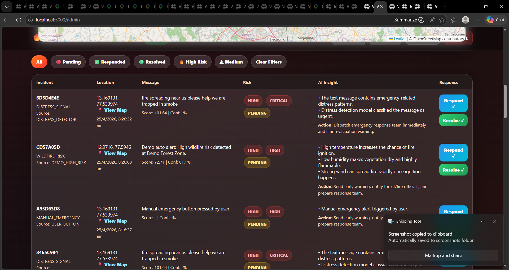
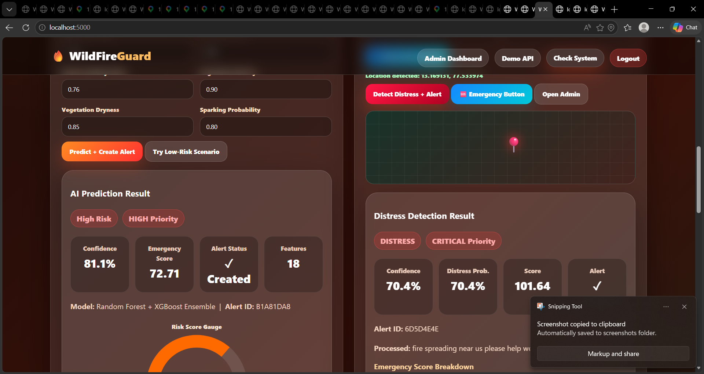
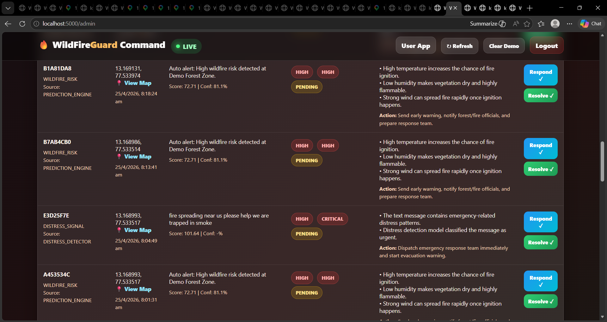
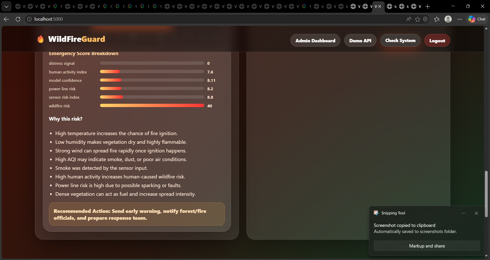
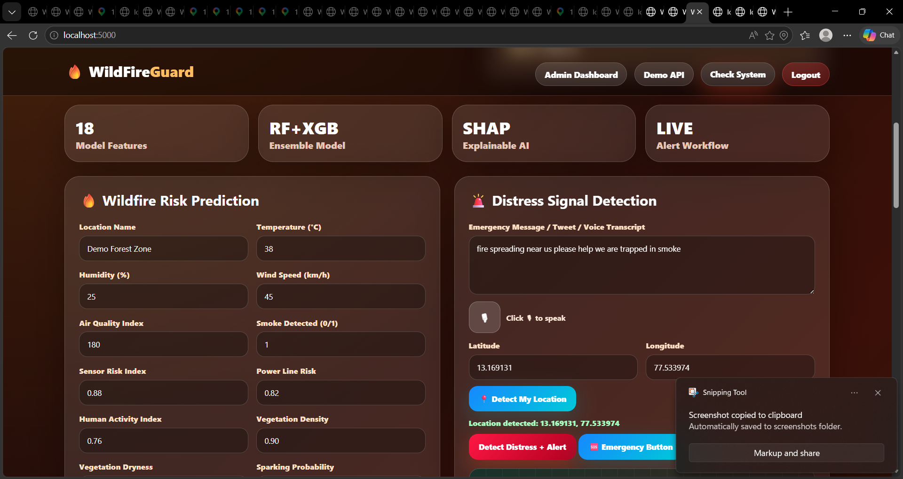

# 🔥 WildFireGuard
### AI-Powered Wildfire Prediction & Emergency Response System

WildFireGuard is an AI-powered disaster preparedness and emergency response system designed to predict wildfire risks before ignition, detect distress signals in real time, and generate automated emergency alerts. The system combines Machine Learning, Flask APIs, and an interactive dashboard to enable proactive disaster management and faster emergency response.

---

## 📌 Problem Statement

Wildfires cause severe environmental damage, loss of biodiversity, and pose a significant threat to human life. Most existing systems detect fires only after ignition, resulting in delayed emergency response.

WildFireGuard addresses this challenge by combining **early wildfire prediction** with **real-time distress detection** and **automated alert generation** into a single intelligent platform.

---

## ✨ Key Features

- 🔥 Early Wildfire Risk Prediction
- 🚨 Real-Time Distress Detection
- 📍 Location-Based Emergency Alerts
- 🤖 Machine Learning Based Decision Making
- 📊 Interactive Admin Dashboard
- 🗄️ SQLite Database for Alert Storage
- 📧 Email Alert Simulation
- 🌿 Multi-Source Environmental Data Analysis
- ⚡ Automatic Emergency Alert Generation

---

## 🧠 Machine Learning Models Used

### Wildfire Prediction
- Random Forest
- XGBoost

### Distress Detection
- Logistic Regression (TF-IDF based NLP)

---

## 📊 Input Features

The wildfire prediction model considers multiple environmental and human-related parameters including:

- Temperature
- Humidity
- Wind Speed
- Soil Moisture
- Air Quality
- Smoke Level
- Vegetation Index (NDVI)
- Human Activity Index
- Power Line Risk
- Sensor Data
- Weather Parameters

---

## 🏗️ System Architecture

```
                 Environmental Data
                         │
                         ▼
               Data Preprocessing
                         │
                         ▼
        Feature Engineering & Extraction
                         │
         ┌───────────────┴───────────────┐
         ▼                               ▼
 Wildfire Prediction            Distress Detection
(Random Forest + XGBoost)     (TF-IDF + Logistic Regression)
         │                               │
         └───────────────┬───────────────┘
                         ▼
                 Decision Engine
                         │
                         ▼
              Emergency Alert System
                         │
                         ▼
              Interactive Dashboard
```

---

## 💻 Tech Stack

### Backend
- Python
- Flask

### Machine Learning
- Scikit-learn
- XGBoost

### Frontend
- HTML
- CSS
- JavaScript

### Database
- SQLite

### Libraries
- Pandas
- NumPy
- Joblib

---

## 📂 Project Structure

```
wildfire_guard/
│
├── backend/
│   ├── app.py
│   ├── train_model.py
│   ├── evaluate_model.py
│   └── data_pipeline.py
│
├── frontend/
│   ├── index.html
│   └── admin.html
│
├── data/
│
├── models/
│
├── requirements.txt
│
├── run.py
│
└── README.md
```

---

## 🚀 Installation

Clone the repository

```bash
git clone https://github.com/veekshitha-rachar/wildfire_guard.git
```

Move into the project

```bash
cd wildfire_guard
```

Install dependencies

```bash
pip install -r requirements.txt
```

Run the application

```bash
python run.py
```

---

## 🚀 Workflow

1. User enters environmental parameters.
2. Machine Learning models predict wildfire risk.
3. Distress messages are analyzed.
4. Decision engine evaluates the emergency level.
5. Alerts are generated automatically.
6. Admin dashboard displays live alerts and their status.

## 📸 Application Screenshots

### 🏠 Home Dashboard



---

### 🔥 Wildfire Prediction



---

### 📊 Risk Analytics Dashboard



---

### 📈 Monitoring Dashboard



---

### 🚨 Emergency Command Dashboard



---

### 📍 Live Alert Map



---

### 📈 Prediction Results



---

### 📋 Alert Management



## 🔮 Extending the System

1. **More training data**: Add Kaggle datasets to `data/` and update `data_pipeline.py`
2. **Real database**: Replace `ALERTS = {}` in `app.py` with SQLite / PostgreSQL
3. **SMS alerts**: Integrate Twilio API in the `/alert` route
4. **Image CNN**: Add MobileNet inference in `/image-predict` route
5. **Real-time map**: Embed Leaflet.js map in admin dashboard with live alert pins
6. **Push notifications**: Use Firebase FCM for mobile alerts

---
## 📈 Future Scope

- IoT Sensor Integration
- Satellite Data Integration
- Live Weather APIs
- SMS / WhatsApp Alert System
- Mobile Application
- Wildfire Spread Prediction
- Explainable AI (XAI)
- Cloud Deployment

---

## 👩‍💻 Author

**Veekshitha Achar**

- GitHub: https://github.com/veekshitha-rachar
- LinkedIn: https://www.linkedin.com/in/veekshitha-r-achar/

---
